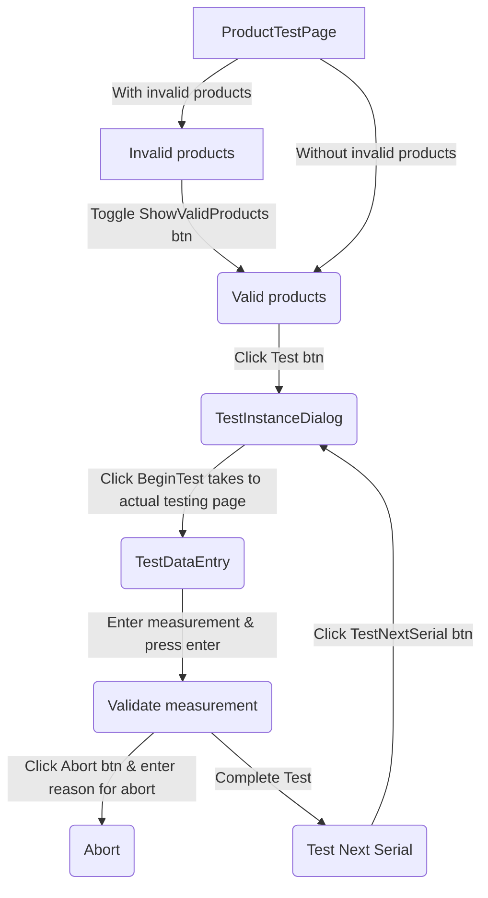
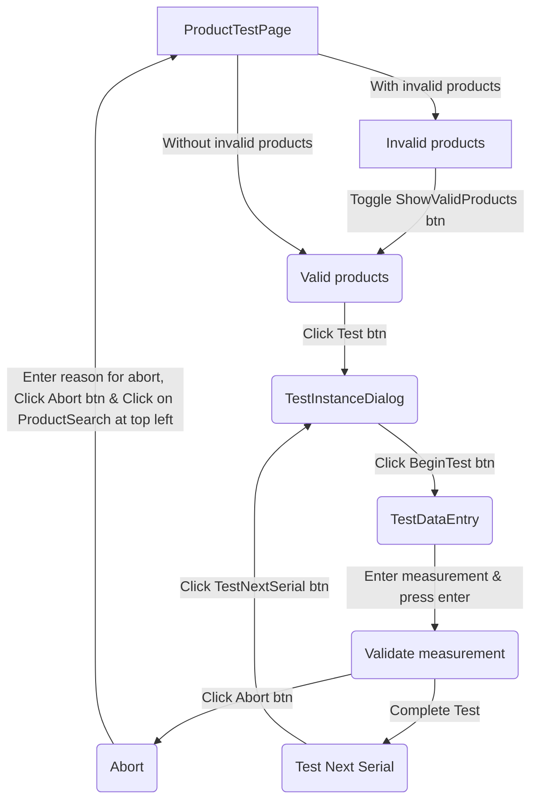

```mermaid
   flowchart TD
    A[ProductTestPage] -->|With invalid products| B(Invalid products)
    B[Invalid products] -->|Toggle ShowValidProducts btn| C(Valid products)
    A[ProductTestPage] -->|Without invalid products| C(Valid products)
    C --> |Click Test btn| D(TestInstanceDialog)
    D --> |Click BeginTest takes to actual testing page| E(TestDataEntry)
    E --> |Enter measurement & press enter| F(Validate measurement)
    F --> |Click Abort btn & enter reason for abort| G(Abort)
    F --> |Complete Test| H(Test Next Serial)
    H --> |Click TestNextSerial btn| D
```

```mermaid
   flowchart TD
    A[ProductTestPage] -->|With invalid products| B(Invalid products)
    B[Invalid products] -->|Toggle ShowValidProducts btn| C(Valid products)
    A[ProductTestPage] -->|Without invalid products| C(Valid products)
    C --> |Click Test btn| D(TestInstanceDialog)
    D --> |Click BeginTest btn| E(TestDataEntry)
    E --> |Enter measurement & press enter| F(Validate measurement)
    F --> |Click Abort btn| G(Abort)
    F --> |Complete Test| H(Test Next Serial)
    H --> |Click TestNextSerial btn| D
    G --> |Enter reason for abort, Click Abort btn & Click on ProductSearch at top left| A
```
